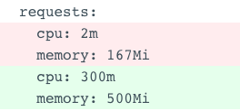

<p align="center">
  
</p>
<p align="center">A Kubernetes controller to optimize pod requests. A VPA Alternative.</p>

<p align="center">
<a  target="_blank"></a>
<a  target="_blank"></a>
<a  target="_blank"></a>
<a  target="_blank"></a>
</p>

<p align="center">
  
</p>

**kube-reqsizer** is a kubernetes controller that will measure the usage of pods over time and optimize (reduce/increase) their requests based on the average usage.

When all required conditions meet, the controller calculates the result requirements based on all the samples taken so far a pod and its peers in the same deployment controller.
It then goes "upstream" to the parent controller of that pod, for example *Deployment*, and updates the relevant containers for the pods inside the deployment as a reconciliation, as if its desired state is the new state with the new requirements.



**Note:** This is an alternative to [Vertical-Pod-Autoscaler](https://github.com/kubernetes/autoscaler/tree/master/vertical-pod-autoscaler). The intended use of this project is to provide a simpler, more straightforward install and mechanism, without CRDs, **and that can work with [Horizontal-Pod-Autoscaler](https://kubernetes.io/docs/tasks/run-application/horizontal-pod-autoscale/).**
## Deploy - Helm

```bash
helm repo add kube-reqsizer https://jatalocks.github.io/kube-reqsizer/
helm repo update
helm install kube-reqsizer/kube-reqsizer
```

**Core Values:**

```yaml
enabledAnnotation: true
sampleSize: 1
minSeconds: 1
enableIncrease: true
enableReduce: true
maxMemory: 0
minMemory: 0
maxCPU: 0
minCPU: 0
minCPUIncreasePercentage: 0
minCPUDecreasePercentage: 0
minMemoryIncreasePercentage: 0
minMemoryDecreasePercentage: 0
cpuFactor: 1
memoryFactor: 1
logLevel: info
concurrentWorkers: 10
persistence:
  enabled: true
```
## Prerequisites
- The metrics server must be deployed in your cluster. Read more about [Metrics Server](https://github.com/kubernetes-sigs/metrics-server). This controller uses the **metrics.k8s.io** extension API group (apis/metrics.k8s.io/v1beta1)

## Usage

**kube-reqsizer** has primary custom flags:

```bash
# Enable a annotation filter for pod scraping. 
# True will only set requests of controllers of which PODS or NAMESPACE 
# have the annotation set to "true".
# If "false", will ignore annotations and work 
# on all pods in the cluster unless
# they have "false".

# reqsizer.jatalocks.github.io/optimize=true
# reqsizer.jatalocks.github.io/optimize=false
--annotation-filter bool (default true)

# The sample size to create an average from when reconciling.
--sample-size int (default 1)

# Minimum seconds between pod restart.
# This ensures the controller will not restart a pod if the minimum time
# has not passed since it has started.
--min-seconds float (default 1)

# Allow controller to reduce/increase requests
--enable-increase (default true)
--enable-reduce (default true)

# Min and Max CPU (m) and Memory (Mi) the controller can set a pod request to. 0 is infinite
--max-cpu int (default 0)
--max-memory int (default 0)
--min-cpu int (default 0)
--min-memory int (default 0)

# Min CPU and Memory (%) the controller will count as a condition to resize requests.
# For Example:
# If reqsizer wants to increase from 90m to 100m, that's a 10% increase. 
# It will ignore it if min-cpu-increase-percentage is more than 10.
# If reqsizer wants to decrease from 100m to 10m, that's a 90% decrease. 
# It will ignore it if min-cpu-decrease-percentage is more than 90.
--min-cpu-increase-percentage int (default 0)
--min-memory-increase-percentage int (default 0)
--min-cpu-decrease-percentage int (default 0)
--min-memory-decrease-percentage int (default 0)

# Multiply requests when reconciling
--cpu-factor float (default 1)
--memory-factor float (default 1)

# How many pods to sample in parallel. This may affect the controllers stability.
--concurrent-workers (default 10)

# Persistence using Redis
--enable-persistence (default false)
--redis-host (default "localhost")
--redis-port (default "6379")
--redis-password (default "")
--redis-db (default 0)
```

### Annotations 

*If **annotation-filter** is **true**:*
```
reqsizer.jatalocks.github.io/optimize=true  # Optimize Pod/Namespace
reqsizer.jatalocks.github.io/optimize=false # Ignore Pod/Namespace
```
There are Pod/Namespace annotations available *Regardless of **annotation-filter**:*
```
reqsizer.jatalocks.github.io/optimize=false # Ignore Pod/Namespace when optimizing entire cluster
reqsizer.jatalocks.github.io/mode=average   # Default Mode. Optimizes based on average. If ommited, mode is average
reqsizer.jatalocks.github.io/mode=max       # Sets the request to the MAXIMUM of all sample points
reqsizer.jatalocks.github.io/mode=min       # Sets the request to the MINIMUM of all sample points
```
### Disclaimer

`sample-size` is the amount of data-points the controller will store in cache before constructing an average for the pod. After a requests resizing, the cache will clean itself and a new average will be calculated based on the sample size. If `min-seconds` have not yet passed since the pod has been scheduled, the controller will keep sampling the pod until `min-seconds` have been reached and only then zero the sample and restart from cache.

### Monitoring - Prometheus
| Metric  | Type | Description |
| ------------- | ------------- | ------------- |
| kube_reqsizer_cpu_offset  | Gauge  | Number of milli-cores that have been increased/removed since startup. Can be a positive/negative value.  |
| kube_reqsizer_memory_offset  | Gauge  | Number of megabits that have been increased/removed since startup. Can be a positive/negative value.  |
| kube_reqsizer_cache_size  | Gauge  | Number of pod controllers currently in cache.  |
### Edge Cases

1. All samples in a certain cycle report `0` (less than 1):
   1. **mode=average**: The controller will ignore the pod and not reconcile.
   2. **mode=min**: The controller will put `1m` or `1Mi` as a value.
   3. **mode=max**: The controller will ignore the pod and not reconcile.
1. One or more of the samples in a certain cycle reports `0` (less than 1):
   1. **mode=average**: Will take the `0` into consideration.
   2. **mode=min**: Will consider the `0` as `1`.
   3. **mode=max**: Will ignore the sample.
2. **annotation-filter** is `true` (`optimize=false` is as strong as **deny**):
   1. A namespace has `optimize=false` but a pod has `optimize=true`:
      1. The controller will ignore the pod and not reconcile.
   2. A namespace has `optimize=true` but a pod has `optimize=false`:
      1. The controller will ignore the pod and not reconcile.

## Limitations

- Does not work with CRD controllers (such as Argo Rollouts)
# Development
## Getting Started
You’ll need a Kubernetes cluster to run against. You can use [KIND](https://sigs.k8s.io/kind) to get a local cluster for testing, or run against a remote cluster.
**Note:** Your controller will automatically use the current context in your kubeconfig file (i.e. whatever cluster `kubectl cluster-info` shows).

### Running on the cluster

1. Run the controller:
```sh
go run main.go
```

**OR**

2. Build and push your image to the location specified by `IMG`:
	
```sh
make docker-build docker-push IMG=<some-registry>/kube-reqsizer:tag
```
	
2. Deploy the controller to the cluster with the image specified by `IMG`:

```sh
make deploy IMG=<some-registry>/kube-reqsizer:tag
```
### Undeploy controller
UnDeploy the controller to the cluster:

```sh
make undeploy
```
